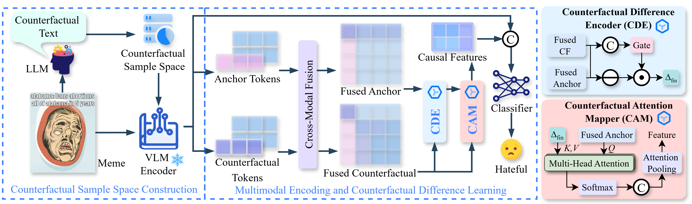

# FROM SEMANTIC SHIFTS TO CAUSAL CUES: COUNTERFACTUAL LEARNING FOR HATEFUL MEME DETECTION



## 🔍 Project Overview
Memes often hide hateful content through complex interactions between images and text, making existing multimodal detectors struggle to isolate **causal features** of hateful intent (e.g., relying on spurious correlations like background images). 

We propose **CAFT** (Counterfactual Attribution & Feature Transformer), a causal reasoning-driven framework that constructs controlled counterfactual samples to disentangle causal signals from surface correlations. CAFT achieves state-of-the-art performance on three benchmark datasets and provides interpretable token-level evidence for model decisions.

## 🎯 Key Contributions
1. **Causal-Oriented Framework**: First to adapt counterfactual reasoning for hateful meme detection, explicitly extracting causal evidence across modalities.
2. **Novel Core Modules**: 
   - `Counterfactual Difference Encoder (CDE)`: Captures feature discrepancies between anchor and counterfactual samples.
   - `Counterfactual Attention Mapper (CAM)`: Projects causal signals to token level for interpretability.
3. **Robust Training Strategy**: Integrates consistency and contrastive losses to suppress spurious correlations and enhance generalization.

## 🛠️ Method Overview
CAFT's pipeline consists of four core components:

### 1. Counterfactual Sample Space Construction
Using a prompted LLM (Qwen2.5-VL), we generate triplets `(Anchor, Positive, Negative)` for each meme:
- **Anchor**: Original meme `(I_a, T_a, Y_a)` (image, text, label).
- **Positive**: Same-label variant (paraphrased text, preserved semantics/intent).
- **Negative**: Label-flipping variant (minimal edits: inject/remove hate-related expressions).

### 2. Multimodal Encoding
A frozen vision-language model (CLIP vit-large-patch14) encodes:
- Global features: Pooled image/text vectors for holistic understanding.
- Local features: Token-level text features and patch-level image features, fused via cross-modal attention.

### 3. Counterfactual Difference Learning
- **CDE**: Computes token-level feature differences between anchor and negative samples, suppressing non-causal noise via a gating mechanism.
- **CAM**: Uses multi-head attention to map causal differences back to anchor tokens, highlighting key causal cues.
- Attention pooling aggregates token-level causal features into a fixed-dimension vector, fused with global features for final prediction.

### 4. Multi-Objective Training
\[
\mathcal{L} = \mathcal{L}_{cls} + \lambda_{cons}\mathcal{L}_{cons} + \lambda_{cont}\mathcal{L}_{cont}
\]
- `L_cls`: Cross-entropy loss for classification.
- `L_cons`: Consistency loss.
- `L_cont`: Contrastive loss.
- 
### Interpretability Visualization
CAFT identifies token-level causal cues (e.g., "black" and "woman" in hateful memes) and separates causal signals in feature space:


🚀 Quick Start

### Environment Setup
```
# Clone the repository
git clone https://github.com/knightcanglu/CAFT.git
cd CAFT

# Create conda environment
conda create -n caft python=3.10
conda activate caft

# Install dependencies
pip install torch==2.1.0 torchvision==0.16.0 torchaudio==2.1.0
pip install transformers==4.35.2 datasets==2.14.6 scikit-learn==1.3.2
pip install clip-anytorch==2.5.2 qwen-vl==0.0.10 einops==0.7.0
```

### Data Preparation
```
Download the three benchmark datasets and organize them as follows:
plaintext
data/
├── FHM
├── HarMeme
└── MAMI
